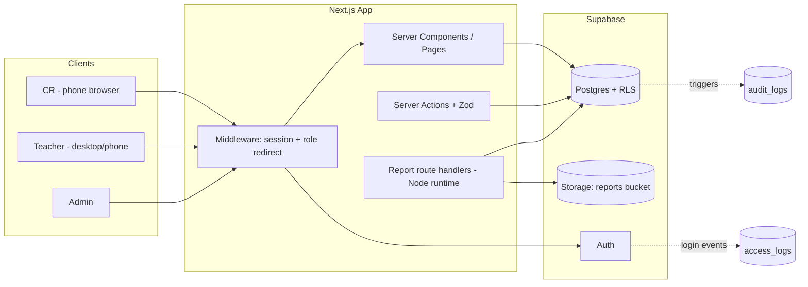
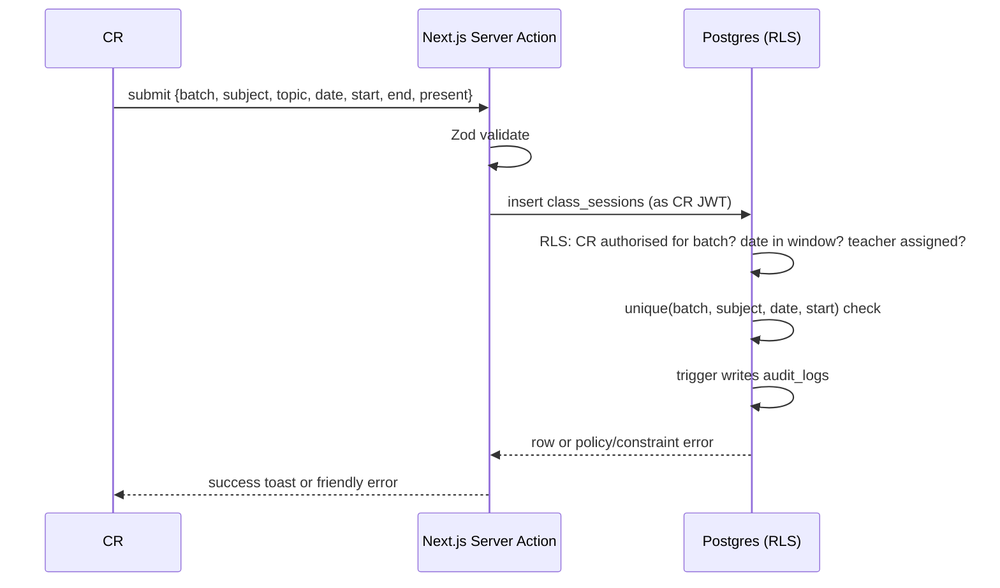
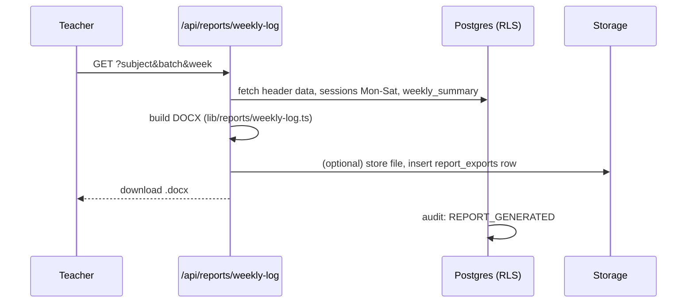

# ARCHITECTURE.md

## 1. Overview

A server-rendered web app (Next.js) on top of Supabase. Supabase provides Postgres, Auth, and Storage. Security is enforced by **Row Level Security (RLS)** in Postgres. The Next.js server handles validation and DOCX generation.



## 2. Design principles

1. **RLS is the security boundary.** The app uses the user's own JWT for reads and writes, so policies apply automatically.
2. **Service role only where unavoidable** (e.g. inviting a user, writing an access-log row on failed login). It is used in isolated server modules and never reaches the client.
3. **Thin UI, strong data model.** Business rules (edit windows, duplicate prevention, authorisation) live in constraints, policies, and triggers.
4. **Reports are pure functions** of query results: `(data) => docx Buffer`. This makes them testable.
5. **Small and boring.** Expected load is tiny (a few hundred sessions per week). No queues, caches, or microservices.

## 3. Roles

| Role | Landing page | Scope |
| --- | --- | --- |
| `cr` | `/cr/log` | One batch (authorised), log and edit recent sessions |
| `teacher` | `/dashboard` | Assigned subjects and batches |
| `admin` | `/admin` | Everything |

Details in [SECURITY.md](./SECURITY.md).

## 4. Key flows

### 4.1 CR logs a class



The form only offers subjects that the CR's batch is assigned (from `teaching_assignments`). Teacher is derived from that assignment, not typed by the CR.

### 4.2 Teacher reviews and verifies

1. Dashboard lists sessions for the teacher's subjects, filtered by week, batch, and status.
2. Teacher opens a session, fills **planned topic**, **teaching method**, **assignment/activity**, optionally links **syllabus topics**, and marks it `verified`.
3. Verified sessions are locked for CRs.

### 4.3 Weekly report generation



### 4.4 CR authorisation

1. Admin (or a teacher of that batch; see [DECISIONS.md](./DECISIONS.md)) invites a student by email and picks the batch and academic year.
2. Server uses the service role to create the auth user (invite), inserts `profiles` (role `cr`) and `cr_authorisations`.
3. Revoking sets `revoked_at`, `revoked_by`, `revoke_reason`. RLS checks `revoked_at is null`, so access ends at once.
4. Both actions are written to `audit_logs`; logins go to `access_logs`.

## 5. Folder structure (planned)

```
teachlog/
├─ app/
│  ├─ (auth)/login/
│  ├─ (cr)/cr/log/            # log a class
│  ├─ (cr)/cr/history/        # my recent entries
│  ├─ (teacher)/dashboard/
│  ├─ (teacher)/sessions/
│  ├─ (teacher)/summaries/
│  ├─ (teacher)/reports/
│  ├─ (admin)/admin/{batches,subjects,syllabus,users,cr-access,logs}/
│  └─ api/reports/[type]/route.ts
├─ components/
├─ lib/
│  ├─ supabase/{client,server,middleware,admin}.ts
│  ├─ auth/roles.ts
│  ├─ validation/*.ts          # Zod schemas
│  ├─ reports/
│  │  ├─ weekly-log.ts
│  │  ├─ styles.ts             # fonts, widths, borders from template
│  │  ├─ coverage.ts           # post-MVP
│  │  └─ builder.ts            # post-MVP
│  └─ dates.ts                 # IST week helpers
├─ supabase/
│  ├─ migrations/
│  └─ seed.sql
├─ templates/                  # reference .docx, never modified
├─ tests/{rls,reports,validation}/
├─ middleware.ts
└─ *.md                        # these docs
```

## 6. Auth approach

- Supabase Auth with **email + password**. No open sign-up: accounts exist only if an admin/teacher invited them.
- A `profiles` row (same `id` as `auth.users`) holds `role` and `is_active`.
- `middleware.ts` refreshes the session, loads the role, and redirects to the right landing page. Unauthorised routes return 403 or redirect.
- `is_active = false` immediately blocks data access via RLS helper `app_role()`.

## 7. Data handling

- **Week logic:** Monday to Saturday in IST. Week number = current week of the respective month (e.g., Week 1 to 5).
- **Snapshots:** `class_sessions` stores `semester` and `academic_year` at time of entry, so history stays correct after a batch is promoted to the next semester.
- **Duplicates:** unique on `(batch_id, subject_id, session_date, start_time)`.
- **Repeat teaching:** the same subject taught to several batches, or several times in a week, is normal. Coverage is computed per `(batch, subject)`, and a subject-level view can compare batches.

## 8. Non-functional targets

| Area | Target |
| --- | --- |
| CR entry | Complete in under 60 seconds, 3 taps for common fields |
| Weekly DOCX | Generated in under 10 seconds |
| Availability | Normal business hours are enough for MVP |
| Backups | Use Supabase backups; confirm the plan's retention and point-in-time options |
| Accessibility | Readable on low-end phones; large tap targets |
| Privacy | Minimal personal data, audit trail, role-based access |

## 9. Deployment

- Environments: `local` (Supabase CLI), `staging` (separate Supabase project), `production`.
- Host the Next.js app on Netlify. Report routes must run on the **Node** runtime.
- Supabase free-tier projects may be paused after inactivity. Check current plan terms before the pilot, and use a paid plan or a keep-alive for production.
- CI: type-check, lint, unit tests, RLS tests against a local Supabase instance.

## 10. Risks

| Risk | Mitigation |
| --- | --- |
| CRs enter wrong or careless data | Teacher verification step, edit window, audit trail |
| CR account shared with classmates | Per-user login, access log, easy revocation |
| Template changes mid-year | All layout constants in `lib/reports/styles.ts`; template kept under `templates/` |
| RLS mistakes leak data across batches | Mandatory RLS test suite; no service-role reads in normal paths |
| Teachers forget to verify or write summaries | Dashboard shows "pending" counts; reminders post-MVP |
