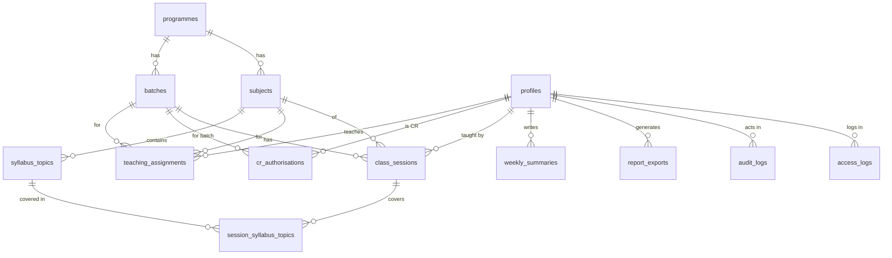

# DATABASE.md

Postgres on Supabase. **This SQL is a draft.** Review it, put it in `supabase/migrations/0001_init.sql`, and test it locally with the Supabase CLI before applying anywhere real. Test every RLS policy (see [INSTRUCTION.md](./INSTRUCTION.md) section 7).

## 1. Entity relationships



## 2. Tables at a glance

| Table | Purpose |
| --- | --- |
| `profiles` | One row per user (admin, teacher, CR). Linked to `auth.users`. |
| `programmes` | Degree programmes (3 years, 6 semesters). |
| `batches` | Student cohorts with current semester and class strength. |
| `subjects` | Subjects per programme and semester. |
| `syllabus_topics` | Ordered topics per subject, for coverage tracking. |
| `teaching_assignments` | Which teacher teaches which subject to which batch in which year. |
| `cr_authorisations` | Register of students authorised as CR: who granted, when, revoked or not. |
| `class_sessions` | The core log: one row per class held. |
| `session_syllabus_topics` | Links a session to the syllabus topics it covered. |
| `weekly_summaries` | Teacher's weekly summary (the 7 template sections). |
| `report_exports` | Record of generated reports. |
| `audit_logs` | Append-only record of data and authorisation changes. |
| `access_logs` | Login, logout, failed login, access-denied events. |

## 3. Schema (draft)

```sql
-- ─────────────────────────────────────────────
-- Enums
-- ─────────────────────────────────────────────
create type user_role      as enum ('admin', 'teacher', 'cr');
create type record_status  as enum ('submitted', 'verified');

-- ─────────────────────────────────────────────
-- Users
-- ─────────────────────────────────────────────
create table profiles (
  id          uuid primary key references auth.users(id) on delete cascade,
  full_name   text not null,
  role        user_role not null,
  department  text,
  is_active   boolean not null default true,
  created_at  timestamptz not null default now()
);

-- ─────────────────────────────────────────────
-- Academic structure
-- ─────────────────────────────────────────────
create table programmes (
  id              uuid primary key default gen_random_uuid(),
  code            text unique not null,
  name            text not null,
  duration_years  int  not null default 3,
  total_semesters int  not null default 6
);

create table batches (
  id                   uuid primary key default gen_random_uuid(),
  programme_id         uuid not null references programmes(id),
  name                 text not null,               -- e.g. 'Intake 2025-28'
  intake_year          int  not null,
  current_semester     int  not null check (current_semester between 1 and 6),
  academic_year        text not null,               -- e.g. '2026-27'
  semester_start_date  date not null,               -- week numbers count from here
  class_strength       int  not null check (class_strength > 0),
  is_active            boolean not null default true,
  unique (programme_id, name)
);

create table subjects (
  id            uuid primary key default gen_random_uuid(),
  programme_id  uuid not null references programmes(id),
  semester      int  not null check (semester between 1 and 6),
  code          text,
  name          text not null,
  unique (programme_id, semester, name)
);

create table syllabus_topics (
  id          uuid primary key default gen_random_uuid(),
  subject_id  uuid not null references subjects(id) on delete cascade,
  unit_no     int,
  seq         int  not null,                        -- order within the subject
  title       text not null,
  unique (subject_id, seq)
);

create table teaching_assignments (
  id             uuid primary key default gen_random_uuid(),
  teacher_id     uuid not null references profiles(id),
  subject_id     uuid not null references subjects(id),
  batch_id       uuid not null references batches(id),
  academic_year  text not null,
  unique (teacher_id, subject_id, batch_id, academic_year)
);

-- ─────────────────────────────────────────────
-- CR authorisation register
-- ─────────────────────────────────────────────
create table cr_authorisations (
  id             uuid primary key default gen_random_uuid(),
  cr_id          uuid not null references profiles(id),
  batch_id       uuid not null references batches(id),
  academic_year  text not null,
  granted_by     uuid not null references profiles(id),
  granted_at     timestamptz not null default now(),
  revoked_by     uuid references profiles(id),
  revoked_at     timestamptz,
  revoke_reason  text
);
-- Only one active authorisation per CR + batch + year
create unique index cr_auth_one_active
  on cr_authorisations (cr_id, batch_id, academic_year)
  where revoked_at is null;

-- ─────────────────────────────────────────────
-- Core log
-- ─────────────────────────────────────────────
create table class_sessions (
  id                  uuid primary key default gen_random_uuid(),
  batch_id            uuid not null references batches(id),
  subject_id          uuid not null references subjects(id),
  teacher_id          uuid not null references profiles(id),
  semester            int  not null check (semester between 1 and 6),  -- snapshot
  academic_year       text not null,                                   -- snapshot
  session_date        date not null,
  start_time          time not null,
  end_time            time not null,
  students_present    int  not null check (students_present >= 0),
  topic_covered       text not null,                 -- entered by CR
  -- teacher-enriched fields (template columns)
  topic_planned       text,
  teaching_method     text,
  assignment_activity text,
  status              record_status not null default 'submitted',
  verified_by         uuid references profiles(id),
  verified_at         timestamptz,
  entered_by          uuid not null references profiles(id),
  created_at          timestamptz not null default now(),
  updated_at          timestamptz not null default now(),
  check (end_time > start_time),
  unique (batch_id, subject_id, session_date, start_time)
);
create index on class_sessions (batch_id, session_date);
create index on class_sessions (teacher_id, session_date);
create index on class_sessions (subject_id, batch_id);

create table session_syllabus_topics (
  session_id        uuid not null references class_sessions(id) on delete cascade,
  syllabus_topic_id uuid not null references syllabus_topics(id),
  primary key (session_id, syllabus_topic_id)
);

-- ─────────────────────────────────────────────
-- Weekly summary (7 sections of the IIHM template)
-- ─────────────────────────────────────────────
create table weekly_summaries (
  id                  uuid primary key default gen_random_uuid(),
  teacher_id          uuid not null references profiles(id),
  subject_id          uuid not null references subjects(id),
  batch_id            uuid not null references batches(id),
  week_start          date not null,                -- the Monday
  syllabus_coverage   text,
  practical_conducted text,
  assessment_conducted text,
  slow_learners       text,
  remedial_action     text,
  ai_digital_tools    text,
  industry_examples   text,
  status              record_status not null default 'submitted',
  submitted_on        date,
  created_at          timestamptz not null default now(),
  updated_at          timestamptz not null default now(),
  check (extract(isodow from week_start) = 1),
  unique (teacher_id, subject_id, batch_id, week_start)
);

-- ─────────────────────────────────────────────
-- Reports, audit, access
-- ─────────────────────────────────────────────
create table report_exports (
  id            uuid primary key default gen_random_uuid(),
  generated_by  uuid not null references profiles(id),
  report_type   text not null,                      -- 'weekly_log', 'coverage', ...
  params        jsonb not null,
  storage_path  text,
  created_at    timestamptz not null default now()
);

create table audit_logs (
  id          bigint generated always as identity primary key,
  actor_id    uuid references profiles(id),
  action      text not null,                        -- INSERT / UPDATE / DELETE / CR_GRANTED / CR_REVOKED / REPORT_GENERATED
  entity      text not null,
  entity_id   text,
  old_data    jsonb,
  new_data    jsonb,
  created_at  timestamptz not null default now()
);

create table access_logs (
  id          bigint generated always as identity primary key,
  user_id     uuid references profiles(id),
  email       text,                                  -- kept for failed logins where user_id is unknown
  event       text not null,                         -- LOGIN_SUCCESS / LOGIN_FAILED / LOGOUT / ACCESS_DENIED
  ip          inet,
  user_agent  text,
  created_at  timestamptz not null default now()
);
```

## 4. Helper functions and triggers

```sql
-- Role of the current user (null if inactive or unknown)
create or replace function public.app_role()
returns user_role
language sql stable security definer set search_path = public as $$
  select role from public.profiles where id = auth.uid() and is_active
$$;

-- Is the current user an active CR for this batch?
create or replace function public.cr_has_batch(p_batch uuid)
returns boolean
language sql stable security definer set search_path = public as $$
  select exists (
    select 1 from public.cr_authorisations
    where cr_id = auth.uid() and batch_id = p_batch and revoked_at is null
  )
$$;

-- Generic audit trigger
create or replace function public.log_row_change()
returns trigger
language plpgsql security definer set search_path = public as $$
begin
  insert into public.audit_logs (actor_id, action, entity, entity_id, old_data, new_data)
  values (
    auth.uid(), tg_op, tg_table_name,
    coalesce(to_jsonb(new)->>'id', to_jsonb(old)->>'id'),
    case when tg_op in ('UPDATE','DELETE') then to_jsonb(old) end,
    case when tg_op in ('INSERT','UPDATE') then to_jsonb(new) end
  );
  return coalesce(new, old);
end $$;

create trigger audit_class_sessions
  after insert or update or delete on class_sessions
  for each row execute function log_row_change();
create trigger audit_weekly_summaries
  after insert or update or delete on weekly_summaries
  for each row execute function log_row_change();
create trigger audit_cr_authorisations
  after insert or update or delete on cr_authorisations
  for each row execute function log_row_change();

-- Keep updated_at fresh
create or replace function public.touch_updated_at()
returns trigger language plpgsql as $$
begin new.updated_at = now(); return new; end $$;

create trigger touch_class_sessions before update on class_sessions
  for each row execute function touch_updated_at();
create trigger touch_weekly_summaries before update on weekly_summaries
  for each row execute function touch_updated_at();
```

**Still to write in the migration:** a trigger that stops CRs from changing teacher-owned columns (`topic_planned`, `teaching_method`, `assignment_activity`, `status`, `verified_*`) and from changing `batch_id`, `subject_id`, `teacher_id` on update. RLS restricts rows, not columns, so this needs a trigger or a column-level approach.

## 5. Row Level Security (draft)

```sql
alter table profiles              enable row level security;
alter table programmes            enable row level security;
alter table batches               enable row level security;
alter table subjects              enable row level security;
alter table syllabus_topics       enable row level security;
alter table teaching_assignments  enable row level security;
alter table cr_authorisations     enable row level security;
alter table class_sessions        enable row level security;
alter table session_syllabus_topics enable row level security;
alter table weekly_summaries      enable row level security;
alter table report_exports        enable row level security;
alter table audit_logs            enable row level security;
alter table access_logs           enable row level security;
```

### class_sessions

```sql
-- READ
create policy sessions_select on class_sessions for select using (
  app_role() = 'admin'
  or (app_role() = 'teacher' and teacher_id = auth.uid())
  or (app_role() = 'cr'      and cr_has_batch(batch_id))
);

-- CR INSERT: authorised batch, recent date, valid teaching assignment
create policy sessions_cr_insert on class_sessions for insert with check (
  app_role() = 'cr'
  and cr_has_batch(batch_id)
  and entered_by = auth.uid()
  and session_date between current_date - 2 and current_date
  and status = 'submitted'
  and exists (
    select 1 from teaching_assignments ta
    where ta.batch_id   = class_sessions.batch_id
      and ta.subject_id = class_sessions.subject_id
      and ta.teacher_id = class_sessions.teacher_id
  )
);

-- CR UPDATE: own entries, 24 hours, not yet verified
create policy sessions_cr_update on class_sessions for update
using (
  app_role() = 'cr' and cr_has_batch(batch_id)
  and entered_by = auth.uid()
  and status <> 'verified'
  and created_at > now() - interval '24 hours'
)
with check (
  app_role() = 'cr' and cr_has_batch(batch_id) and entered_by = auth.uid()
);

-- TEACHER: full control of own sessions (no hard delete; see below)
create policy sessions_teacher_write on class_sessions for insert
  with check (app_role() = 'teacher' and teacher_id = auth.uid() and entered_by = auth.uid());
create policy sessions_teacher_update on class_sessions for update
  using (app_role() = 'teacher' and teacher_id = auth.uid())
  with check (app_role() = 'teacher' and teacher_id = auth.uid());

-- ADMIN: everything
create policy sessions_admin_all on class_sessions for all
  using (app_role() = 'admin') with check (app_role() = 'admin');
```

There is intentionally **no delete policy** for CRs or teachers. If deletion is needed later, add a `deleted_at` column and filter it in policies.

### Other tables (sketch)

| Table | Read | Write |
| --- | --- | --- |
| `profiles` | Own row; admin all; teachers see CRs of their batches | Admin only (via server) |
| `programmes`, `batches`, `subjects`, `syllabus_topics` | Any authenticated active user | Admin only |
| `teaching_assignments` | Teacher own rows; CR rows for own batch; admin all | Admin only |
| `cr_authorisations` | CR own rows; teacher rows for batches they teach; admin all | Admin (and teachers for their batches, pending decision D-08) via server |
| `weekly_summaries` | Teacher own; admin all | Teacher own; admin |
| `report_exports` | Owner; admin all | Insert by owner via server |
| `audit_logs` | Admin all; teacher rows about their own batches (post-MVP) | **None from clients.** Written by triggers and server. |
| `access_logs` | Admin all | **None from clients.** Written by server. |

Revoke `update` and `delete` on `audit_logs` and `access_logs` from all API roles so they stay append-only.

## 6. Coverage view

```sql
create view v_syllabus_coverage with (security_invoker = true) as
select
  ta.batch_id,
  ta.subject_id,
  ta.academic_year,
  (select count(*) from syllabus_topics st
    where st.subject_id = ta.subject_id) as total_topics,
  (select count(distinct sst.syllabus_topic_id)
     from session_syllabus_topics sst
     join class_sessions cs on cs.id = sst.session_id
    where cs.batch_id = ta.batch_id
      and cs.subject_id = ta.subject_id) as covered_topics
from teaching_assignments ta;
```

`security_invoker` makes the view respect the caller's RLS.

## 7. Seed data (for development only)

- 1 programme, 6 semesters
- 2 batches (different current semesters)
- 6-8 subjects with 10-15 syllabus topics each
- 3 teachers, 2 CRs, 1 admin
- Teaching assignments including **one subject taught to two batches**, and **one teacher with three subjects**, to exercise the "repeat teaching" case
- ~2 weeks of sessions, some verified, some not

Use obviously fake names and emails. Never seed real student data.

## 8. Migration plan

| File | Content |
| --- | --- |
| `0001_init.sql` | Enums, tables, indexes |
| `0002_functions_triggers.sql` | Helpers, audit and `updated_at` triggers, CR column guard |
| `0003_rls.sql` | Enable RLS and all policies |
| `0004_views.sql` | Coverage view |
| `seed.sql` | Dev seed |

## 9. Points to confirm before the first migration

- "Total students" is modelled as `students_present` per session, plus `batches.class_strength` for the full count. See D-01 in [DECISIONS.md](./DECISIONS.md).
- "Week No." is confirmed as the week number of the respective month (Week 1 to 5). See D-05 in [DECISIONS.md](./DECISIONS.md).
- Whether more than one programme is needed on day one.
